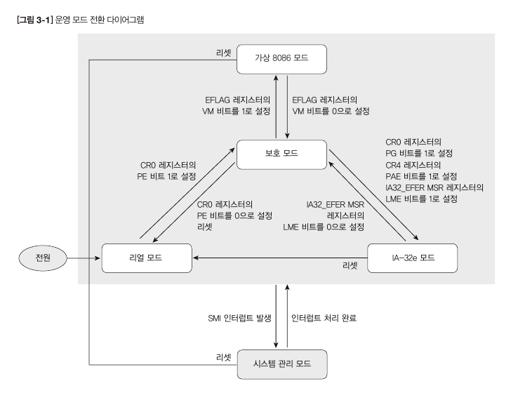
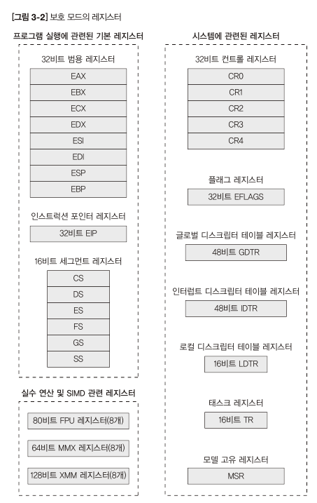
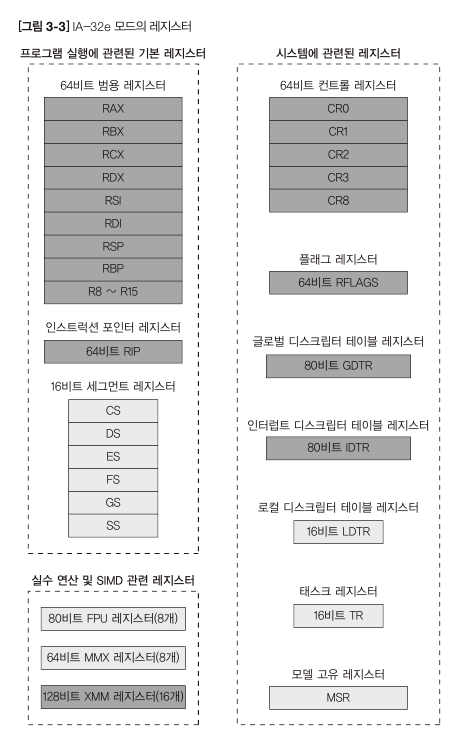
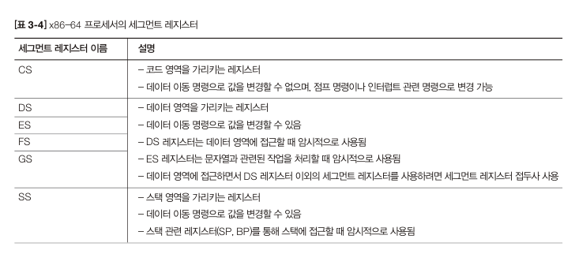
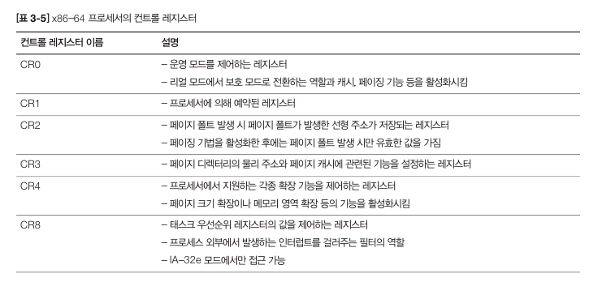
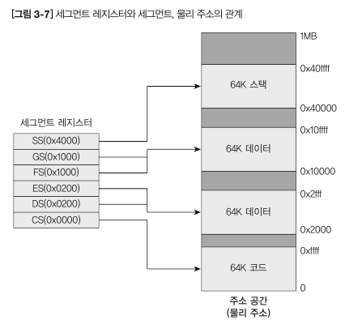

# 3장에서 다룰 내용
- OS를 구동할 프로세서에 대한 지식
- 64비트 프로세서의 내부 구조를 간략하게 설명하고, 운영 모드별 메모리 관리 기법의 공통점과 차이점을 살펴본다.
- 64비트 프로세서에는 크게 16비트, 32비트, 64비트 모드가 있으며, 각 모드에 따라 프로세서는 조금씩 다른 방식으로 동작합니다.
- OS 개발하려면 각 모드와 모드의 차이점을 알아야 합니다. 이는 직접 프로세서를 제어하고 모드를 전환할 때 필요한 초기화를 수행해야 하기 떄문이다.

## 3.1 운영모드
- 주변에서 사용하는 인텔 64비트 호환 프로세서(x86-64 프로세서)에는 크게 다섯 가지 운영 모드가 있다.

1. 16비트의 리얼 모드
2. 32비트의 보호 모드
3. 64비트의 IA-32e 모드와 조금 낯선 시스템 관리 모드
4. 가상 8086모드

- 각 모드에는 다음과 같은 특징이 있고, 컨트롤 레지스터와 인터럽트라는 특수한 이벤트를 통해 각 모드로 전환할 수 있습니다.

| 운영 모드      | 설명                                                                           |
|------------|------------------------------------------------------------------------------|
| 리얼 모드      | - 프로세서의 초기 상태로서 16비트 모드로 동작하며 8086 프로세서와 호환되는 모드 최대 1MD(2^20)의 주소 공간을 지원 |
| 보호 모드      | 32비트 모드로 동작하며 세그먼트, 페이징, 보호, 멀티태스킹 등의 기능을 제공하는 모드 4GB(2^32)의 주소 공간을 지원   |
| IA-32e 모드  | 32비트 호환 모드와 64비트 모드의 두 가지 서브모드로 구성 16EB(2^64)의 주소 공간을 지원하는 모드            |
| 시스템 관리 모드  | 전원 관리나 하드웨어 제어 같은 특수 기능을 제공하는 모드                                             |
| 가상 8086 모드 | 보호 모드 내부에서 가상의 환경을 설정하여 리얼 모드처럼 동작하는 모드                                      |

- 64비트 모드를 지원하는 IA-32e 모드는 제조사에 따라 다르게 불려진다. -> 인텔에서는 IA-32e 모드로 표기, AMD에서는 Long Mode로 표기
- 앞으로 우리가 만들 64비트 멀티코어 OS는 전원 관리 기능이나 보호 모드에서 16비트 코드를 실행하는 기능을 지원하지 않으므로, 시스템 관리 모드와 가상 8086 모드를 제외한 세 가지 모드만 구현한다.

1. 리얼 모드
2. 64비트 서브모드(IA-32e 모드)
3. 보호 모드

### 리얼 모드
프로세서가 어떤 상태 또는 모드에 있든 전원이 켜지거나 리셋되면 프로세서는 리얼 모드로 진입합니다.
- 리얼 모드는 과거의 16비트 프로세서와 동일하게 동작하며, 이후에 설명할 BIOS의 여러 기능을 사용할 수 있습니다.
- BIOS는 디스크 읽기 및 쓰기 기능부터 그래픽모드로 전환하는 기능까지 여러가지 기능을 제공하며, 이를 사용하면 별도의 디바이스 드라이버를 제작하지 않고도 원하는 작업을 수행할 수 있다.
- 리얼모드에서 하는 작업
  - OS 이미지를 디스크에서 메모리로 복사하여, 보호 모드로 변경하는 것
    -> 해당 작업은 어셈블리어로 처리해야 한다.

### 보호 모드
리얼모드에서 IA-32e 모드로 전환하려면 반드시 보호 모드를 거쳐야 한다.
- 보호 모드는 32비트 윈도우나 리눅스 OS가 동작하는 기본 모드이다.
    - 최대 4G(2^32) 주소 공간을 제공한다.
    - OS의 필수 기능으로 자리 잡은 보호, 멀티태스킹, 세그먼테이션, 페이징 등의 기능을 하드웨어적으로 지원한다.
    - 제리스터와 자료구조가 다양하다.

### IA-32e 모드
- IA-32e 모드에는 서브모드로 32비트 호환 모드와 64비트 모드가 잇다.
- 32비트 호환 모드는 보호모드와 같은 기능을 수행
- 최대 16E(2^64)의 주소 공간을 제공하며 레지스터 수도 보호모드보다 많다.
- 32비트 호환 모드에 있는 것처럼 동작하므로, 32비트 코드를 그대로 실행할 수 있다는 점이다.

## 운영모드 사이의 관계와 운영 모드의 전환
- 특정 모드에서 다른 모드로 전환하는 작업은 현재 동작 중인 모드에 따라 차이가 있습니다.
- 리얼 모드에서 보호 모드로 전환하는 상황처럼 다른 모드를 거치지 않고 바로 전환 가능한 경우도 있지만, 리얼모드에서 IA-32e 모드로 전환하는 상황과 같이 리얼모드 -> 보호모드 -> IA-32e를 거쳐서 전환해야 하는 경우도 있다.

1. 전원이 켜지거나 리셋되면 프로세서는 리얼 모드로 진입한다.
2. 리얼모드에서 전환할 수 있는 유일한 모드는 공식적으로 보호 모드뿐이다.
3. 보호모드에서는 가상 8086모드, IA-32e모드, 다시 리얼 모드로 전환할 수 있다.
4. 시스템 관리 모드는 모든 모드에서 진입할 수 있다.
 

## 운영모드와 레지스터
OS를 개발하는 관점에서 운영 모드는 크게 16비트 모드, 32비트 모드, 64비트 모드 세 가지로 나눌 수 있따.

- 보호모드의 레지스터

||  |
|--|--|
|||

- OS를 개발하는 과정에서 큰 비중을 차지하는 레지스터는 범용 레지스터, 세그먼트 레지스터, 컨트롤 레지스터 3가지입니다.
    - 위 3가지 레지스터를 제외한 레지스터는 사용빈도가 극히 적거나 직접 레지스터에 값을 설정할 일이 거의 없다.

### 범용 레지스터 (General Purpose Register)
- 운영 모드와 가장 관계가 깊은 레지스터이다.
- 범용 레지스터는 계산, 메모리 어드레스 지정, 임시 저장 공간 등의 목적으로 사용합니다.
- 범용 레지스터의 수는 프로세서가 지원하는 운영모드에 따라 다르다.
- 16비트와 32비트 모드를 지원하는 x86 계열(인텔 32비트 호환 프로세서)은 8개, 64비트 모드를 지원하는 x86-64 계열은 16개의 범용 레지스터가 있다.

### 세그먼트 레지스터 (Segment Register)
- 16비트 레지스터로 어드레스 영역을 다양한 크기로 구분하는 역할을 합니다.
- 모드마다 조금씩 역할에 차이가 있습니다.
- 리얼모드에서는 : 단순히 고정된 크기의 어드레스 영역을 지정하는 역할만 한다.
- 보호모드, IA-32e모드에서는 접근 권한(Privilege Level), 세그먼트의 시작 어드레스와 크기 등을 지정하는 데 사용되기도 한다.
- 이러한 기능을 통해 -> 커널 영역을 보호하는 기능을 쉽게 구현 가능

- 메모리 관리 기법에는 크게 세그먼테이션 기법과 페이징 기법 두 가지가 있다.
  - 이중에서 세그먼트 레지스터를 통해 주소 공간을 구분하는 방식 : 세그먼테이션

### 컨트롤 레지스터(Control Register)
- 현재 운영 중인 모드의 특정 기능을 제어하는 레지스터이다.
- x86 프로세서에는 CR0, CR1, CR2, CR3, CR4의 5개의 컨트롤 레지스터가 존재하며, x86-64 프로세서에는 CR8이 추가되어 총 6개의 컨트롤 레지스터가 있다.

- 각 컨트롤 레지스터의 역할

# 운영 모드와 메모리 관리 기법
x86과 x86-64 프로세서에서 지원하는 메모리 관리 기법은 크게 두가지이다.

- 주소 공간을 특정 영역으로 나눈다.
1. 세그먼테이션(Segmentation) - 전체 영역을 원하는 크기로 나누어 관리하는 방식
2. 페이징(Paging) - 일정한 단위로 잘라진 조각을 모아 원하는 크기로 관리하는 방식

## 리얼 모드의 메모리 관리 방식
- 리얼 모드는 최대 1MB까지 주소 공간을 사용하며 세그먼테이션만 지원한다.
- 리얼 모드에서 세그먼트 크기는 64K로 고정이고, 세그먼트의 시작 어드레스는 세그먼트 레지스터에 직접 설정한다.

- 리얼 모드는 페이징을 사용하지 않으므로 물리 주소로 변환하는 방식이 비교적 간단하다.
- 리얼 모드의 세그먼테이션은 세그먼트 레지스터의 값에 범용 레지스터의 값을 더하는 방식으로 동작합니다.

## 보호 모드의 메모리 관리 방식
- 세그먼테이션과 페이징을 모두 지원한다.
- 보호 모드의 세그먼테이션은 리얼 모드의 세그먼테이션보다 많은 기능을 제공한다. 또한 보호 모드의 세그먼테이션은 세그먼트 레지스터에 세그먼트의 기준 주소를 직접 설정하는 대신 디스크립터 자료구조의 위치를 설정하는 방식으로 바뀌었습니다.
- 세그먼트 레지스터의 명칭도 세그먼트 디스크립터를 선택한다는 의미에서 세그먼트 셀렉터로 변경되었다.
- 디스크립터는 메모리 영역의 정보를 저장하는 자료구조로 여러 종류가 있다. 그중 세그먼트에 대한 정보를 나타내는 디스크립터를 세그먼트 디스크립터라고 부른다.
- 세그먼트 디스크립터에는 세그먼트의 시작 어드레스 크기와 권한, 타입 등의 정보가 있다.
- 접근하는 어드레스가 세그먼트의 크기를 넘어서는 경우 예외 
- 보호 모드에서 주소를 계산하는 방법은 리얼 모드와 마찬가지로 세그먼트 레지스터의 기준 주소에 범용 레지스터의 값을 더해서 구합니다.

