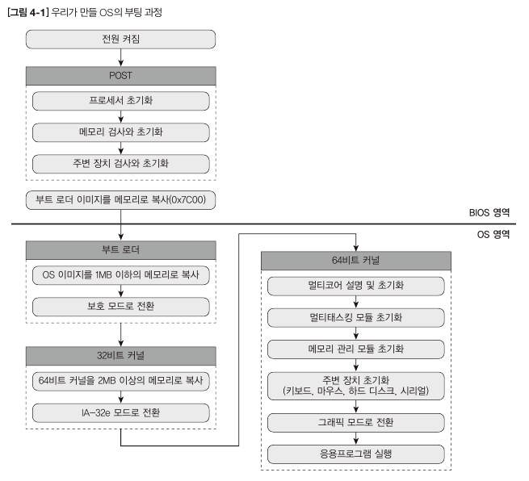

# 부팅과 부르 로더
- 모든 OS는 동등하게 512바이트 크기의 작은 코드에서 시작된다.
- 이는 부트 로더(Boot loader)라고 불리며, OS의 나머지 코드를 메모리에 복사해 실행시킵니다.

### 부팅과 BIOS
부팅(Booting)은 PC가 켜진 후에 OS가 실행되기 전까지 수행되는 일련의 작업 과정을 의미합니다.
부팅 과정에서 수행하는 작업에는 
1. 프로세서 초기화(멀티코어 관련 처리 포함)
2. 메모리와 외부 디바이스 검사 및 초기화
3. 부트로더를 메모리에 복사하고 OS를 시작하는 과정

- 부팅 과정 중 하드웨어와 관련된 작업을 BIOS가 담당하며, BIOS에서 수행하는 각종 테스트나 초기화를 POST라고 부릅니다.
- BIOS는 메인보드에 포함된 펌웨어(Firmware)의 일종으로, 이름 그대로 입출력을 담당하는 작은 프로그램이다.
- 보통 PC 메인 보드에 롬(ROM)이나 플래시 메모리로 존재하며, 전원이 켜짐과 동시에 프로세서가 가장 먼저 실행하는 코드입니다.
- BIOS는 부팅 옵션 설정이나 시스템 전반적인 설정 값(Configuration)을 관리하는 역할도 겸하고 있으며, 설정 값으로 시스템을 초기화하여 OS를 실행할 수 있는 환경을 만듭니다.
- BIOS는 예전 16비트 환경부터 디스크 입출력과 비디오 모드 전환 등 여러 가지 기능을 제공해왔습니다.
- BIOS는 예전 16비트 환경부터 디스크 입출력과 비디오 모드 전환 등 여러 가지 기능을 제공해왔습니다.
- BIOS에서 제공하는 기능은 인터럽트를 통해 사용할 수 있으며, MS-DOS 같은 과거의 16비트 OS는 BIOS의 기능에 많이 의존했습니다.
- MINT64 OS도 OS이미지를 메모리에 복사하고 GUI 모드로 변환할 때 BIOS의 기능을 사용합니다.

- 우리에게 가장 중요한 것은 부트 로더 이미지를 메모리로 복사하는 단계입니다.
- 부트 로더는 부트스트랩 코드라고도 불리며 우리가 BIOS에서 처음으로 제어를 넘겨받는 부분입니다.
- 루트로더는 플로피 디스크나 하드 디스크 등 저장 매체의 가장 앞부분에 존재합니다.
- PC는 디스크나 플래시 메모리 등 다양한 장치로 부팅할 수 있으므로 BIOS는 POST가 완료된 후 여러 장치를 검사하여 앞부분에 부트로더가 있는지 확인합니다.
- 부트 로더가 존재한다면 코드를 0x7C00 어드레스에 복사한 후 프로세서가 0x7C00 어드레스부터 코드를 수행하도록 합니다.
- 부팅 가능한 모든 장치를 검사했는데도 부트 로더를 찾을 수 없다면  BIOS 'Operating System Not Found'와 같은 메시지를 출력하고 작업을 중단합니다.
- 부트 로더가 디스크에서 메모리로 복사되어 실행되었다는 것은 BIOS에 의해 PC가 정상적으로 구동되었다는 것을 의미합니다.
- 부트로더는 크기가 512바이트로 정해져 있습니다.
- 4장과 5장에서 우리가 만들 부트로더 역시 OS이미지를 디스크에서 메모리로 복사하는 역할만 수행합니다.

- 이러한 사태를 방지하려면 BIOS는 첫 번째 섹터에 있는 데이터가 부트 로더인지 확인해야 합니다.
- 이를 위해 BIOS는 읽어들인 512바이트 중에 가장 마지막 2바이트의 값이 0x55, 0xAA인지 검사해서 부트로더인지 확인합니다.
- 읽은 데이터가 0x55, 0xAA로 끝나지 않는다면 데이터로 인식하고 부팅 과정을 더 진행하지 않습니다.

### 부트 로더 제작을 위한 준비
